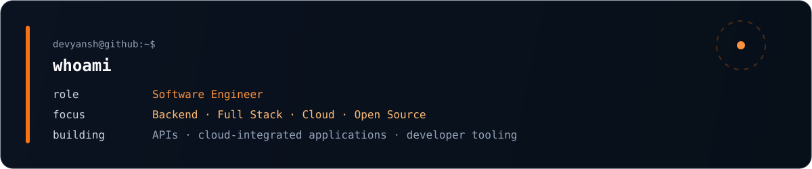

  

  

  
  

  

  

## Engineering

- Backend services and APIs with **C#, .NET, Java, Python and Azure Functions**
- Full-stack applications with **TypeScript, React and Next.js**
- Cloud integrations using **Azure, Cosmos DB, Microsoft Graph and Azure AI Search**
- Authentication, authorization, data modeling and system integrations

  

## Stack

  

  C++ · C# · Java · TypeScript · JavaScript · Python · .NET · Spring · React · Next.js · Azure · Docker · MongoDB · Git

  

## Selected Engineering Work

| Area | Development work |
|---|---|
| **Document Intelligence** | React + TypeScript applications with C# Azure Functions, Azure AI Search, Cosmos DB and Microsoft Graph for document retrieval and AI-assisted workflows |
| **Cloud Applications** | Authenticated APIs, authorization, validation, role-based access and Azure-integrated backend services |
| **Meeting & Collaboration** | React + MSAL + Azure Functions application flows with attendee authorization, enterprise data access and role-filtered content |
| **Production Web Platform** | Next.js application work spanning backend integrations, caching, security controls and production-focused web development |

## Open Source

[`mcp-migrate`](https://github.com/dheerajjha/mcp-migrate) — contributed a merged fix for an R006 SSE detection edge case, including regression coverage to avoid unrelated false positives.

  

## Development Activity

  <picture>
    <source media="(prefers-color-scheme: dark)" srcset="https://github-readme-stats.vercel.app/api?username=DevyanshMalhotra&show_icons=true&hide_border=true&rank_icon=github&theme=github_dark&bg_color=00000000&title_color=F97316&icon_color=FB923C&text_color=C9D1D9" />
    
  </picture>
  <picture>
    <source media="(prefers-color-scheme: dark)" srcset="https://streak-stats.demolab.com?user=DevyanshMalhotra&theme=github-dark-blue&hide_border=true&background=00000000&ring=F97316&fire=FB923C&currStreakLabel=F97316&sideLabels=94A3B8&dates=64748B" />
    
  </picture>

  

